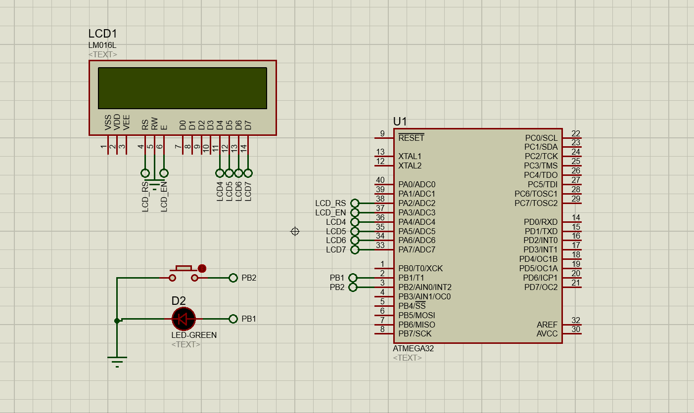

# LED, Button & LCD
This project is more of a proof of concept and a learning step to learn more about using Semaphore to synchronize shared resource like the LCD, 
where two functions (task1 & task2 used it to display different counters)

## Demo

## Techniques
In this project I used:
1. Binary Semaphore
2. Preemptive Kernel
3. Round Robin scheduler

## Drivers
* LCD

## Operating System
* FreeRTOS