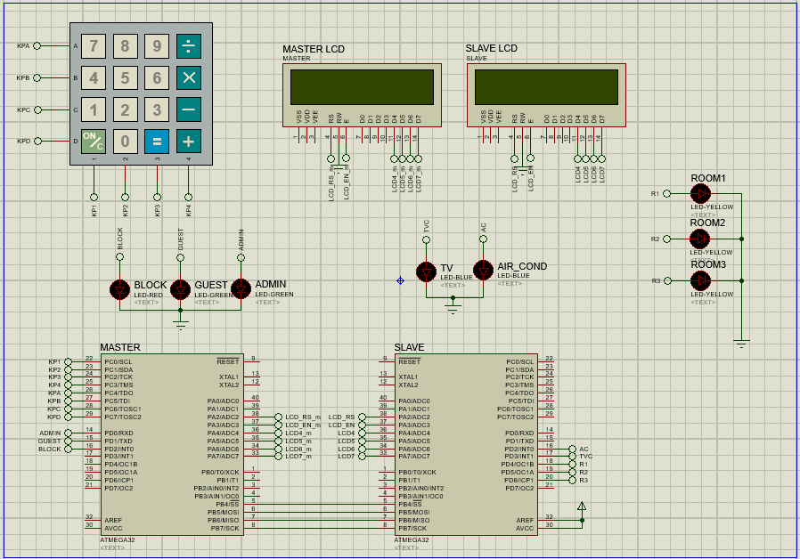
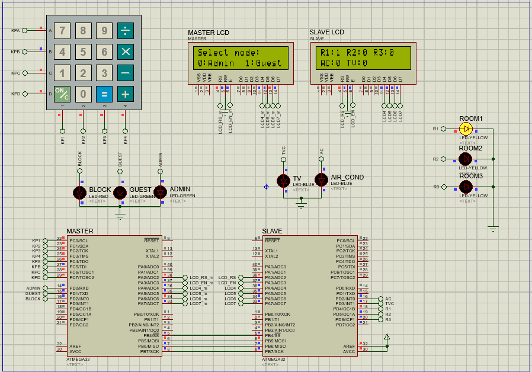
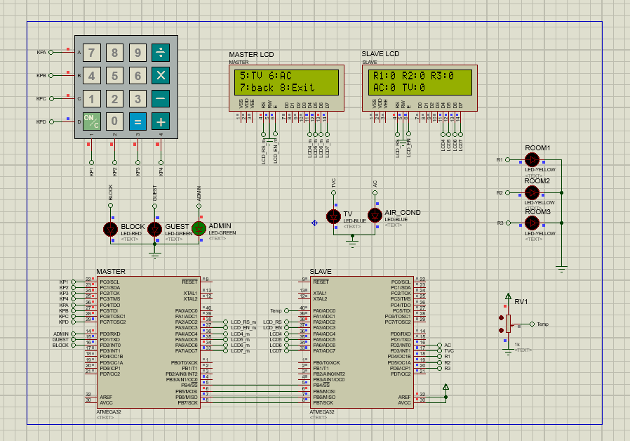

# SMART Home using FreeRTOS
Smart home project that controls different rooms lighting, AC and TV unit using two ATmega32 microcontroller.

## System Components
* 2 Atmega32
* Keypad
* 2 LCDs
* LEDs
* Temp Sensor

## Communication Protocol Used
* SPI

## Demo
### First Time logging in
Setting the password for the Admin and the Guest which will be saved in the EEPROM.

### Block Mode
Block Mode is activated when the password is incorrect and it blocks the system for x seconds.

### Guest Mode
The guest mode have access to room lights only.

### Admin Mode
The admin mode have full access.

### Temperature
If the Temperature is more than X and the the AC mode is turned on my the Admin then the AC will work.

